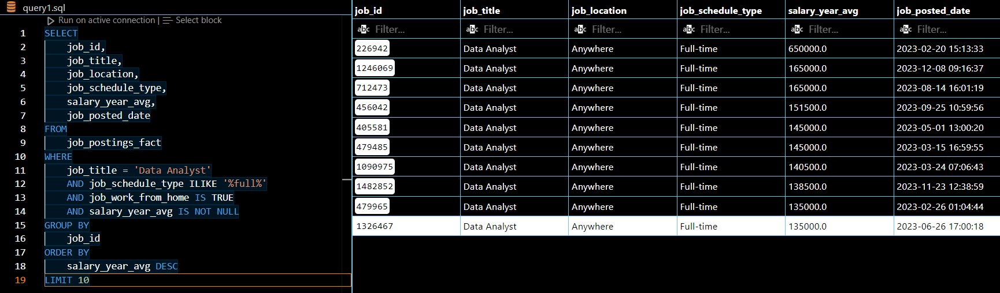
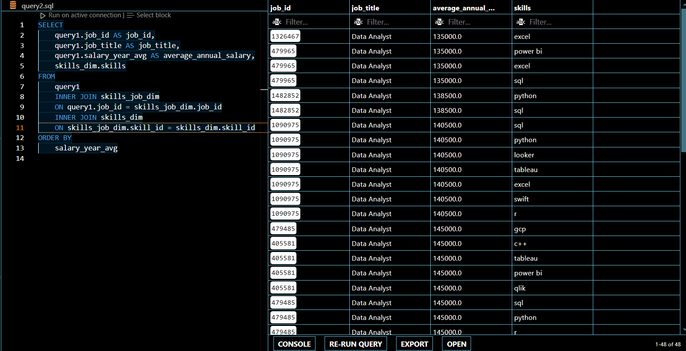
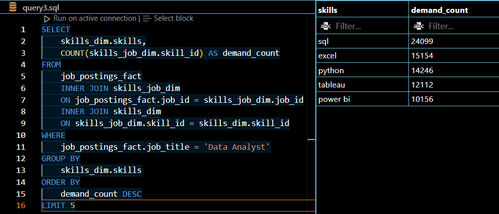

# SQL Capstone Project
This project is used to display a culmination of all skills gained through the Luke Barousse "SQL for Data Analytics" course.

## Questions to Answer
1. What are the top-paying jobs for my role?
2. What are the skills required for these top-paying roles? 
3. What are the most in-demand skills for my role?
4. What are the top skills based on salary for my role? 
5. What are the most optimal skills to learn?

### Question 1 - What are the top paying jobs for Data Analytics?
The below image shows the query and results table.
I am specifically looking for Data Analyst jobs that are remote and full-time. 

### Question 2 - What are the skills required for these top-paying roles?
The below image is the query to find this information, utilizing query1 from the prior question. 
NOTE: I could have alternatively turned query1 into a CTE and used that in place of the query1 table.

### Question 3 - What are the most in-demand skills for my role?
I am looking for the most in-demand skills for a Data Analyst. Below is the query and results

### Question 4 - What are the top skills based on salary for my role?

### Question 5 - What are the most optimal skills to learn?