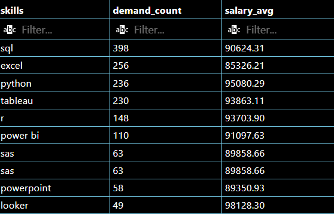

# SQL Capstone Project
This project is used to display a culmination of all skills gained through the Luke Barousse "SQL for Data Analytics" course.

## Questions to Answer
1. What are the top-paying jobs for my role?
2. What are the skills required for these top-paying roles? 
3. What are the most in-demand skills for my role?
4. What are the top skills based on salary for my role? 
5. What are the most optimal skills to learn?

### Question 1 - What are the top paying jobs for Data Analytics?
The below image shows the query and results table.
I am specifically looking for Data Analyst jobs that are remote and full-time. 

### Question 2 - What are the skills required for these top-paying roles?
The below image is the query to find this information, utilizing query1 from the prior question. 
NOTE: I could have alternatively turned query1 into a CTE and used that in place of the query1 table.

### Question 3 - What are the most in-demand skills for my role?
I am looking for the most in-demand skills for a Data Analyst. Below is the query and results

### Question 4 - What are the top skills based on salary for my role?
Utilizing the query below, I was able to find the top-paying skills (see table w/ query).

### Question 5 - What are the most optimal skills to learn?
Below is the information for the "most optimal skills". The query was a bit long with the CTEs so I do not have a screenshot. 
Results of Query: 

QUERY (too long to screenshot)
WITH in_demand_skills AS ( --Query3 being adapted
    SELECT
    skills_dim.skill_id,
    skills_dim.skills AS skills,
    COUNT(skills_job_dim.skill_id) AS demand_count
FROM
    job_postings_fact
    INNER JOIN skills_job_dim
    ON job_postings_fact.job_id = skills_job_dim.job_id
    INNER JOIN skills_dim
    ON skills_job_dim.skill_id = skills_dim.skill_id
WHERE
    job_postings_fact.job_title_short = 'Data Analyst'
    AND job_postings_fact.salary_year_avg IS NOT NULL
    AND job_postings_fact.job_work_from_home = TRUE
GROUP BY
    skills_dim.skill_id
ORDER BY
    demand_count DESC
),

top_paying_skills AS (  --Query4 being adapted
    SELECT
        skills_dim.skill_id,
        skills_dim.skills AS skills,
        ROUND(AVG(job_postings_fact.salary_year_avg), 2) AS salary_avg
    FROM
        job_postings_fact
        INNER JOIN skills_job_dim
        ON job_postings_fact.job_id = skills_job_dim.job_id
        INNER JOIN skills_dim
        ON skills_job_dim.skill_id = skills_dim.skill_id
    WHERE
        job_title = 'Data Analyst'
        AND salary_year_avg IS NOT NULL
        AND job_work_from_home = TRUE -- Looking for remote jobs
    GROUP BY
        skills_dim.skill_id
    ORDER BY
        salary_avg DESC
)

--Main query to find most in-demand and top-paying skills.
SELECT
    in_demand_skills.skills,
    in_demand_skills.demand_count,
    top_paying_skills.salary_avg
FROM
    in_demand_skills
    INNER JOIN top_paying_skills
    ON in_demand_skills.skill_id = top_paying_skills.skill_id
ORDER BY
    demand_count DESC,
    salary_avg DESC
LIMIT 10